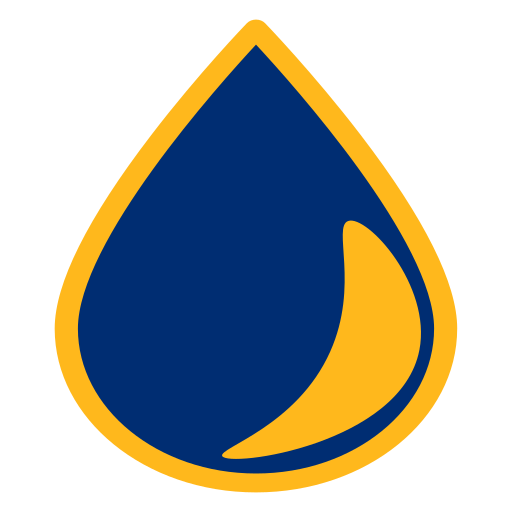
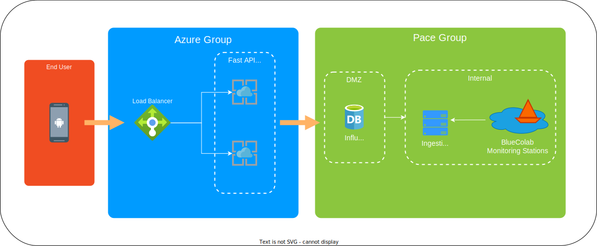
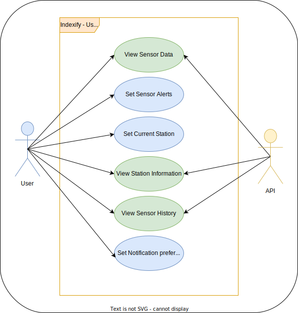
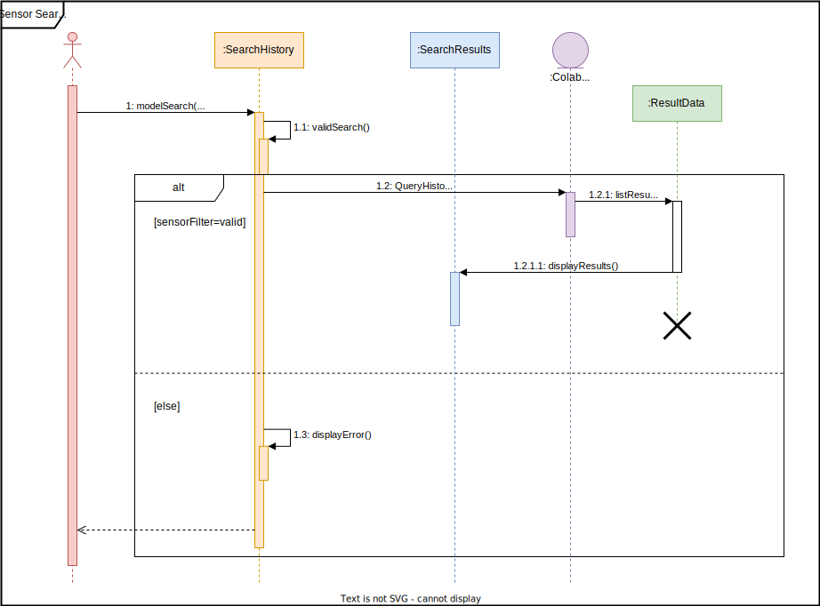
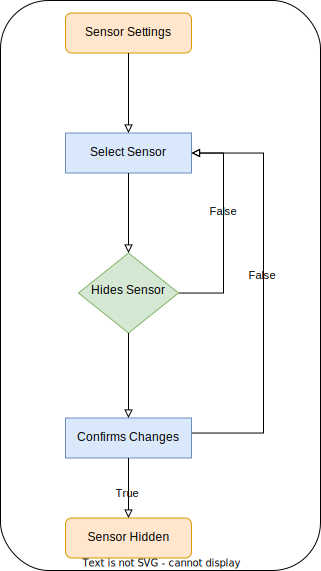

<!-- PROJECT SHIELDS -->
[![Contributors][contributors-shield]][contributors-url]
[![Closed-Pulls][closed-pulls-shield]][closed-pulls-url]
[![Open-Issues][open-issues-shield]][open-issues-url]
[![Closed-Issues][closed-issues-shield]][closed-issues-url]

<!-- PROJECT LOGO -->
 

  

<!-- PROJECT TITLE -->
<h3 align="center">Indexify</h3>
  
  

    A real time water quality monitoring solution for Android!
     
    <a href="https://github.com/orgs/paceuniversity/projects/5"><strong>Project Dashboard »</strong></a>
     
  

<!-- TABLE OF CONTENTS -->

  
Table of Contents

  <ol>
    <li>
      <a href="#about-the-app">About The App</a>
      <ul>
        <li><a href="#app-contributors">App Contributors</a></li>
      </ul>
    </li>
    <li>
      <a href="#requirements-and-discovery">Requirements and Discovery</a>
      <ul>
        <li><a href="#general-requirements">General Requirements</a></li>
        <li><a href="#sprint-backlogs">Sprint Backlogs</a></li>
      </ul>
    </li>
    <li><a href="#development-tools">Development Tools</a></li>
    <li>
      <a href="#architecture-and-design">Architecture and Design</a>
      <ul>
        <li><a href="#physical-architecture">Physical Architecture</a></li>
        <li><a href="#use-case-diagram">Use Case Diagram</a></li>
        <li><a href="#sequence-diagram">Sequence Diagram</a></li>
        <li><a href="#activity-diagram">Activity Diagram</a></li>
      </ul>
    </li>
    <li>
      <a href="#">Sprints</a>
      <ul>
        <li>
          <a href="#">Sprint 1</a>
          <ul>
            <li><a href="#">Scrums</a></li>
            <li><a href="#">Retrospective</a></li>
          </ul>
        </li>
        <li>
          <a href="#">Sprint 2</a>
          <ul>
            <li><a href="#">Scrums</a></li>
            <li><a href="#">Retrospective</a></li>
          </ul>
        </li>
        <li>
          <a href="#">Sprint 3</a>
          <ul>
            <li><a href="#">Scrums</a></li>
            <li><a href="#">Retrospective</a></li>
          </ul>
        </li>
      </ul>
    </li>
  </ol>

<!-- ABOUT THE APP -->
## About The App

To solve Sustainable Development Goal (SDG) #6: Ensure availability and sustainable management of water and sanitation for all, Team 3 is driven to develop a solution. Our goal is a water quality monitoring solution that can be used on smartphones. Specifcally, we are targeting Android based devices for this proof-of-concept.

The accessability to such information is a must for living in a healthy society. People have the right to know what is in their drinking water in a reliable and timely manner. Using latest Android technologies we are building the Kotlin based application to serve the world.

Some notable features included:
* Live sensor data
* Historical search of sensor data
* Viewing different locations 

This is one large step to a better and more sustainable world.

(<a href="#readme-top">back to top</a>)

<h3 id="app-contributors" align="center">App Contributors</h3>

<table>
  <tbody>
    <tr>
      <td align="center"><a href="https://github.com/andrewiadevaia"> <b>Andrew Iadevaia</b></a> </td>
      <td align="center"><a href="https://github.com/jennsommer02"> <b>Jenn Sommer</b></a> </td>
      <td align="center"><a href="https://github.com/Mattbavaro32"> <b>Matt Bavaro</b></a> </td>
      <td align="center"><a href="https://github.com/Falco-code"> <b>Michael Falco</b></a> </td>
    </tr>
  </tbody>
</table>

(<a href="#readme-top">back to top</a>)

<!-- REQUIREMENTS & DISCOVERY -->
## Requirements and Discovery

This section provides the links to this projects requirements and discovery phase documents. Most importantly the sprint backlogs that show our progress and mindset throughout the development process.

### General Requirements
* [User Stories](https://docs.google.com/spreadsheets/d/1pazKeT9Bxtusb0r9nfrSDZGlBs2pEJp0zhjorNtGFBg/edit#gid=8)
* [Persona](https://github.com/paceuniversity/cs389f2022team3/blob/main/documents/persona.pdf)
* [UI Sketch]()

### Sprint Backlogs

* [Sprint 1](https://docs.google.com/spreadsheets/d/1pazKeT9Bxtusb0r9nfrSDZGlBs2pEJp0zhjorNtGFBg/edit#gid=1056044682)
* [Sprint 2](https://docs.google.com/spreadsheets/d/1pazKeT9Bxtusb0r9nfrSDZGlBs2pEJp0zhjorNtGFBg/edit#gid=573988504)
* [Sprint 3]()

(<a href="#readme-top">back to top</a>)

<!-- DEVELOPMENT TOOLS -->
## Development Tools
 

    
    
    
    
    
    
    
    
    

(<a href="#readme-top">back to top</a>)

<!-- ARCH AND DESIGN -->
## Architecture and Design

This section shows diagrams and models ranging from the physical infastructure we developed on to the interactions between certain components in our android app.

### Physical architecture

The backend that our application is built ontop of is cloud based APIs and No SQL timeseries databases to query and store the sensor data infromation that is collected.

    

(<a href="#readme-top">back to top</a>)

### Use case diagram

    

(<a href="#readme-top">back to top</a>)

### Sequence diagram

    

(<a href="#readme-top">back to top</a>)

### Activity diagram

    

(<a href="#readme-top">back to top</a>)

[contributors-shield]: https://img.shields.io/github/contributors/paceuniversity/cs389f2022team3?style=for-the-badge
[contributors-url]: https://github.com/paceuniversity/cs389f2022team3/graphs/contributors

[closed-pulls-shield]: https://img.shields.io/github/issues-pr-closed-raw/paceuniversity/cs389f2022team3?color=informational&style=for-the-badge
[closed-pulls-url]: https://github.com/paceuniversity/cs389f2022team3/pulls?q=is%3Apr+is%3Aclosed

[open-issues-shield]: https://img.shields.io/github/issues-raw/paceuniversity/cs389f2022team3?style=for-the-badge
[open-issues-url]: https://github.com/paceuniversity/cs389f2022team3/issues

[closed-issues-shield]: https://img.shields.io/github/issues-closed-raw/paceuniversity/cs389f2022team3?color=blueviolet&style=for-the-badge
[closed-issues-url]: https://github.com/paceuniversity/cs389f2022team3/issues?q=is%3Aissue+is%3Aclosed
